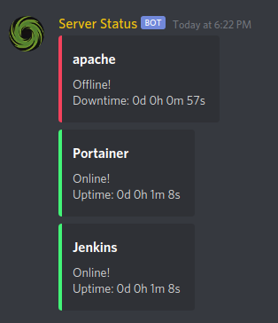

# Server Status
Monitors a list of servers and sends a chat notification when a server goes on or offline.

Enjoy the bot?

<a href="https://www.buymeacoffee.com/mgerb" target="_blank"></a>

## Features

- send channel notifications
- track server up/down time
- **TCP** - should work with all servers
- **UDP** - [Source RCON Protocol](https://developer.valvesoftware.com/wiki/Source_RCON_Protocol) is supported
- [Docker](https://hub.docker.com/r/mgerb/server-status)

### Want to see more features?

[Submit a new issue](https://github.com/mgerb/ServerStatus/issues/new/choose)

## Configuration
- Download the latest release [here](https://github.com/mgerb/ServerStatus/releases)
- Add your bot token as well as other configurations to **config.json**
- Execute the OS specific binary!

### Mentioning Roles/Users
- list of user/role ID's must be in the following format (see below for obtaining ID's)
- `<@userid>`
- `<@&roleid>`

### Polling Interval
The polling interval is how often the bot will try to ping the servers.
A good interval is 10 seconds, but this may need some adjustment if
it happens to be spamming notifications.

- time in seconds
- configurable in **config.json**

## With Docker

```
docker run -it -v /path/to/your/config.json:/server-status/config.json:ro mgerb/server-status
```

### Docker Compose

```
version: "2"

services:
  server-status:
    image: mgerb/server-status:latest
    volumes:
    - /path/to/your/config.json:/server-status/config.json
```

## Usage
To get the current status of your servers simply type `!ServerStatus` in chat.



## Compiling from source
- Make sure Go and Make are installed
- make all

### How to get the bot token
https://github.com/reactiflux/discord-irc/wiki/Creating-a-discord-bot-&-getting-a-token

### How to get your room ID
To get IDs, turn on Developer Mode in the Discord client (User Settings -> Appearance) and then right-click your name/icon anywhere in the client and select Copy ID.


